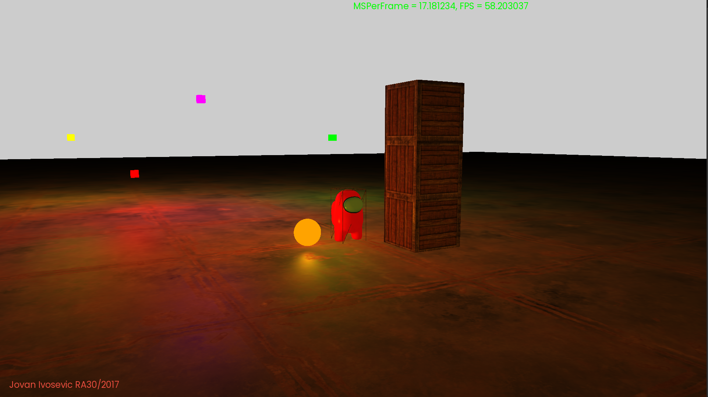

# 3D physics simulation engine for NANS
This is my 3D physics simulation written in C++ (but mainly in C style) using SDL2 and OpenGL.  
I mainly tried writing everything from scratch, but resorted to using some libraries, for now.

## Cool things
* Supports hot loading (you can compile nans.cpp while the engine is running and it (usually) should load the new code.
* Memory arenas, I try to follow Casey Muratori's method that he used in Handmade Hero where the program allocates a chunk of only once at the start
and handles that memory on it's own. In other words, if the initial memory allocation succeeds, the program should, in theory, have no memory problems 'till it's closed. 
* Probably some more cool features which escape me for the moment...

## Engine specs
* Runge-Kutta 4 method is used for integration
* Collision is detected using the GJK algorithm
* Collision info is generated via EPA algorithm
* Sequential impulses is used for collision resolution

## TODO
* Write own library for math operations with matrixes and such, instead of using glm
* Handle simplexes, edges, points and such with memory arenas instead of using C++'s vectors
* Make shaders prettier
* Fix rotation not being handled properly
* ???
